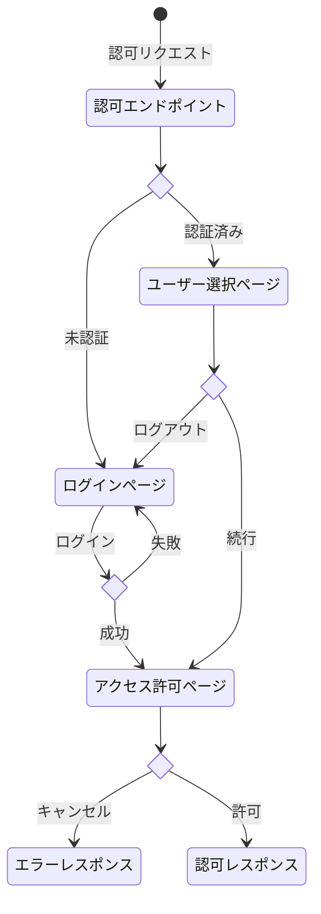

# はじめに

## フロー

```mermaid
stateDiagram-v2
    authz : 認可エンドポイント
    state if_logged_in <<choice>>
    login_page : ログインページ
    consent_page : アクセス許可ページ
    user_selection_page : ユーザー選択ページ
    state user_select <<choice>>
    state login <<choice>>
    state consent <<choice>>
    error_response : エラーレスポンス
    authz_response : 認可レスポンス

    [*] --> authz : 認可リクエスト
    authz --> if_logged_in
    if_logged_in --> login_page : 未認証
    if_logged_in --> user_selection_page : 認証済み

    user_selection_page --> user_select
    user_select --> login_page : ログアウト
    user_select --> consent_page : 続行

    login_page --> login : ログイン
    login --> login_page : 失敗
    login --> consent_page : 成功

    consent_page --> consent
    consent --> error_response : キャンセル
    consent --> authz_response : 許可
```
