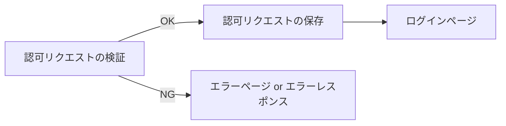
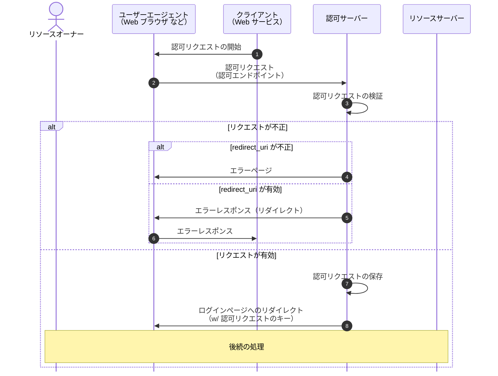
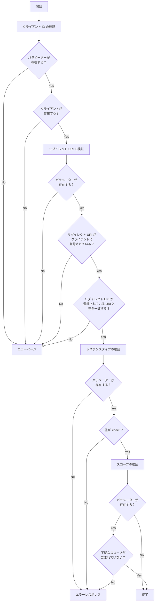

# 認可エンドポイント

## 概要

認可エンドポイントでは認可リクエストを検証します。

検証 NG の場合は "エラーページの表示" または "エラーレスポンスの返却" を行います。
検証 OK の場合は認可リクエストごとに一意のキーを発行してデータストアに保存します。
その後、ログインページに遷移しユーザーの認証状態によって "ログインページ" または "ユーザー選択ページ" が表示されます。

認可リクエストごとに発行した一意のキーは Cookie に格納して後続の処理から参照できるようにします。



## シーケンス



## ルーティングの追加

`src/routes/authorization.ts` を作成します。

ルーティング用の `Hono` インスタンスを生成します。

```ts
const authorizationRoute = new Hono()

export { authorizationRoute }
```

`src/routes/routeTree.ts` に認可エンドポイントのルーティングを追加します。

```diff
const routeTree = new Hono()

+ routeTree.route('/', authorizationRoute)

export { routeTree }
```

## 認可エンドポイントの作成

認可リクエストをクエリパラメーターで受け取る認可エンドポイントのハンドラーを追加します。

```ts
/**
 * 認可エンドポイント
 */
authorizationRoute.get('/auth', (c) => {})
```

認可リクエストのパラメーターは以下の項目をサポートします。

|               |                      |                                                                                                                      |
| ------------- | -------------------- | -------------------------------------------------------------------------------------------------------------------- |
| response_type | 必須                 | 認可グラントが認可コードの場合は `code` にする必要がある。                                                           |
| client_id     | 必須                 | クライアント識別子。指定したクライアントが登録されている必要がある。                                                 |
| redirect_uri  | 必須（RFC では任意） | リソースオーナーとやりとりが完了した後に遷移する先。認可サーバーに事前登録されている必要があり、URI が完全一致する。 |
| scope         | 任意                 | クライアントが要求するアクセス範囲。                                                                                 |
| state         | 推奨                 | CSRF 対策で使用される。                                                                                              |

### 認可リクエストの検証

<details>
<summary>認可リクエストの検証フロー</summary>



</details>

クエリパラメーターの検証は `validator` で行います。

```ts
/**
 * 認可リクエストのバリデーター
 */
const authorizationRequestValidator = validator('query', (_, c) => {
  // 検証処理
})
```

クライアント ID を検証します。
以下のいずれかに当てはまる場合はクライアント ID が不正です。

- パラメーターが含まれていない
- クライアント ID に紐づくクライアントが存在しない

クライアント ID が不正の場合はリダイレクト URI の検証ができないのでエラーページを表示します。

```ts
// クライアント ID
const clientId = c.req.query('client_id')

if (clientId === undefined) {
  return c.html(
    ErrorView({ message: 'client_id がパラメーターに含まれていません。' }),
  )
}

const client = clients.find((client) => client.id === clientId)

if (client === undefined) {
  return c.html(ErrorView({ message: 'クライアントが存在しません。' }))
}
```

リダイレクト URI を検証します。
以下のいずれかに当てはまる場合はリダイレクト URI が不正です。

- パラメーターが含まれていない
- クライアントに事前登録された URI と完全一致しない

リダイレクト URI が不正の場合はエラーページを表示します。

```ts
// リダイレクト URI
const redirectUri = c.req.query('redirect_uri')

if (redirectUri === undefined) {
  return c.html(
    ErrorView({
      message: 'redirect_uri がパラメーターに含まれていません。',
    }),
  )
}

if (!client.redirectUris.includes(redirectUri)) {
  return c.html(
    ErrorView({ message: 'リダイレクト URI が登録されていません。' }),
  )
}
```

ステートの検証は特に行いません。

```ts
// ステート
const state = c.req.query('state')
```

レスポンスタイプを検証します。
以下のいずれかに当てはまる場合はレスポンスタイプが不正です。

- パラメーターが含まれていない
- 値が `code` 以外

レスポンスタイプが不正の場合はエラーレスポンスを返します。

```ts
// レスポンスタイプ
const responseType = c.req.query('response_type')

if (responseType === undefined) {
  return c.redirect(
    createAuthorizationRequestErrorResponseUrl({
      redirectUri,
      errorCode: 'invalid_request',
      errorDescription: "'response_type' required.",
      state,
    }),
  )
}

if (responseType !== 'code') {
  return c.redirect(
    createAuthorizationRequestErrorResponseUrl({
      redirectUri,
      errorCode: 'invalid_request',
      errorDescription: "'response_type' unknown value.",
      state,
    }),
  )
}
```

スコープを検証します。
以下のいずれかに当てはまる場合はスコープが不正です。

- パラメーターが存在し、スペースで分割したスコープがクライアントが定義したスコープに含まれない

スコープが不正の場合はエラーレスポンスを返します。

```ts
// スコープ
const scope = c.req.query('scope')?.split(' ')

if (
  scope !== undefined &&
  !scope.every((value) => client.scope.includes(value))
) {
  return c.redirect(
    createAuthorizationRequestErrorResponseUrl({
      redirectUri,
      errorCode: 'invalid_scope',
      errorDescription: "'scope' unknown value.",
      state,
    }),
  )
}
```
