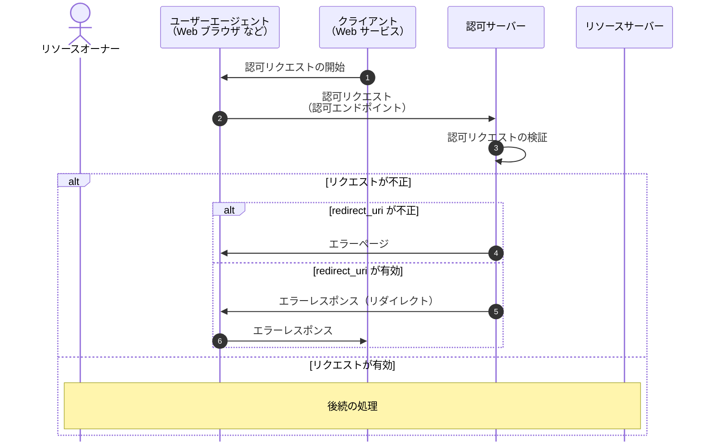
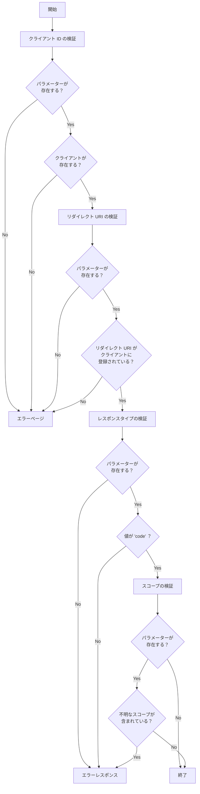

# 認可エンドポイント

認可エンドポイントでは認可リクエストを検証します。

検証 NG の場合は "エラーページの表示" または "エラーレスポンスの返却" を行います。
検証 OK の場合は認可リクエストごとに一意のキーを発行してデータストアに保存します。
その後、ユーザーの認証状態によって "ログインページ" または "ユーザー選択ページ" に遷移します。

認可リクエストごとに発行した一意のキーは Cookie に格納して後続の処理から参照できるようにします。

## シーケンス

## 認可リクエストのパラメーター

| パラメーター名 |                      |                                                                                                  |
| -------------- | -------------------- | ------------------------------------------------------------------------------------------------ |
| response_type  | 必須                 | 認可グラントが認可コードの場合は `code` にする必要がある。                                       |
| client_id      | 必須                 | クライアント識別子。指定したクライアントが登録されている必要がある。                             |
| redirect_uri   | 必須（RFC では任意） | リソースオーナーとやりとりが完了した後に遷移する先。認可サーバーに事前登録されている必要がある。 |
| scope          | 任意                 | クライアントが要求するアクセス範囲。                                                             |
| state          | 推奨                 | CSRF 対策で使用される。                                                                          |

## 認可リクエストの検証フロー

